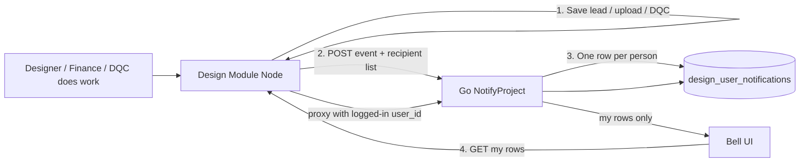
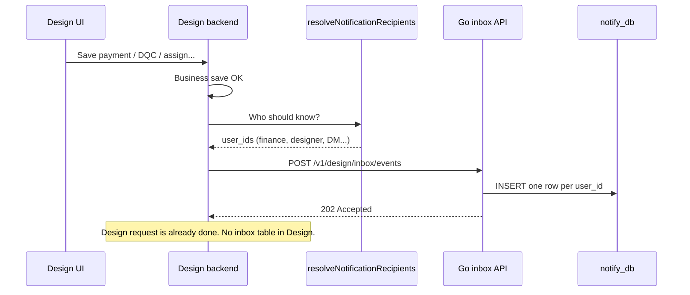
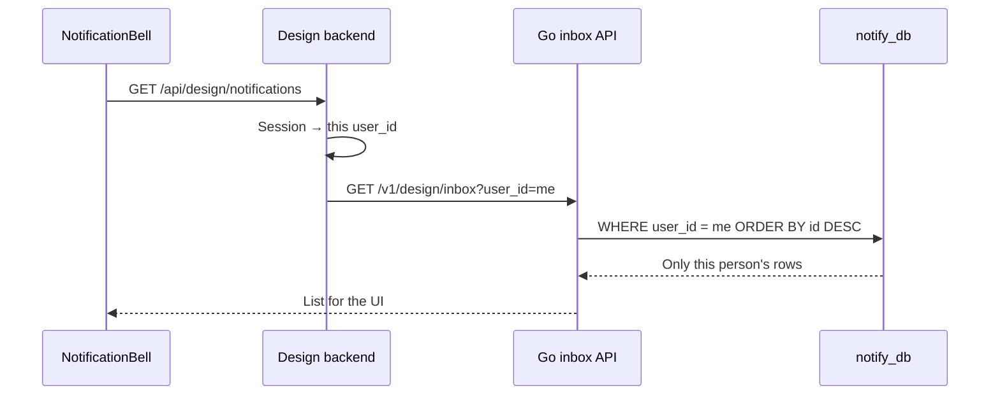
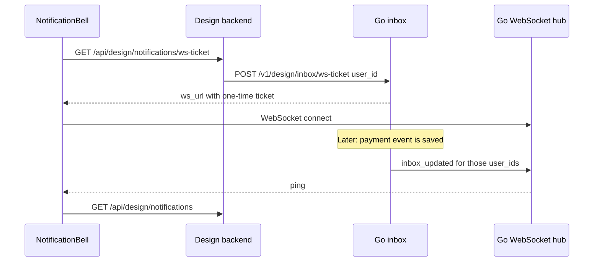
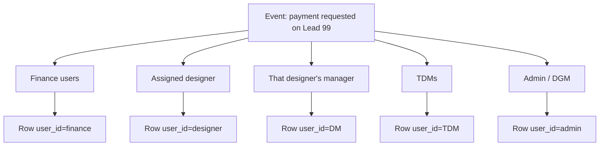

# Design Module Notification System

Easy guide to how notifications work now, why we built it this way, and where to read the code.

---

## 1. One sentence

**Design Module does the real work and only says “this happened.” Go copies that message into each person’s inbox. The bell only reads “my inbox.”**

Think of email:

| Email | Our system |
|---|---|
| You send one mail | One event (payment requested, DQC done, …) |
| To + CC list | Hierarchy: designer, DM, TDM, admin, finance, DQC, PM, MMT |
| Each person has their own mailbox | Each person has their own rows in Go |
| You open *your* inbox | Bell asks Go: `user_id = me` |

---

## 2. Why we chose this approach

### The problem

Many people work in Design at the same time (upload payment, assign PM, DQC, meetings). Each action must notify several people.

If Design Module also:

- formats the message
- saves notifications
- filters “who can see this?” every time someone opens the bell
- holds live connections

…then Design becomes slow. Design’s job is leads, files, and workflow — not being a post office.

### Why Go is in the middle

Go is a separate, fast API service. It can take burst traffic (many events at once) without adding load to the Design Node server.

Design = workshop.  
Go = post office.

### Why one row per person (not one shared list)

**Old way (harder / slower as data grows):**

1. Save **one** row: “payment requested on this lead.”
2. When **anyone** opens the bell, load many rows.
3. In TypeScript, ask for every row: “is this user allowed to see it?”

Admin and TDM pay the cost of scanning **everyone’s** events. That is called **fan-out on read**.

**New way (what we use):**

1. When the event happens, decide the To/CC list **once**.
2. Save **one copy per person** in Go.
3. Bell query is only: `WHERE user_id = me`.

That is called **fan-out on write**. Slack / GitHub / Novu in-app inboxes work like this.

Our fan-out is small (about 5–15 people per event), not millions. So copying rows is cheap. Filtering a huge shared list on every poll is what hurts.

### Why a table is required

If we only used live pop-ups and saved nothing:

- refresh → empty bell
- user was offline → they miss it
- no history, no unread count

So we store inbox rows. Database is the source of truth. Live WebSocket is a **push** on top of that: if you were offline, the row is still waiting.

---

## 3. How it works (diagrams)

### Big picture



### Write path (when something happens)



### Read path (when someone opens the bell)



No “scan all events then filter by role” on this path.

### Live path (WebSocket)



If the socket is down, the bell polls every 30 seconds as backup.

### Example: payment requested



Five people → five rows. Same story, different mailbox.

---

## 4. Why this is faster and easier

| | Old | Now |
|---|---|---|
| Rows per event | 1 shared row | 1 row per person |
| Who decides visibility | Every bell open (TypeScript filter) | Once, at write time |
| Bell SQL | Load many events, then hide most | `WHERE user_id = ?` |
| Load on Design | Save + filter + extra joins | Announce + thin proxy |
| Burst of many operations | Design Node does all of it | Go writes inbox copies |
| Code to change “who sees payment” | Filter function used on every GET | One resolver used on write |

**Easy to think about:**  
“Does finance see this?” → look at finance’s rows. You do not re-run org-tree logic on every poll.

---

## 5. File map — where to read the code

### A. Design Module — announce the event

| File | What to read |
|---|---|
| `FrontandProjects/DesignModulephase1/backend/lib/designNotifyBridge.ts` | After work is saved, `publish()` builds payload, gets recipients, POSTs to Go. Does **not** insert into `design_notifications`. |
| `FrontandProjects/DesignModulephase1/backend/lib/designNotifyAudience.ts` | **Who gets a copy.** Hierarchy rules (designer / DM / TDM / finance / DQC / MMT / PM). |
| `FrontandProjects/DesignModulephase1/backend/lib/designNotifyClient.ts` | HTTP client: `postDesignInboxEvent`, `fetchDesignInbox`, counts, detail. Talks to Go `localhost:8080`. |
| `FrontandProjects/DesignModulephase1/backend/server.ts` | Creates the bridge (`createDesignNotifyBridge`) and registers bell routes. Search `designNotify` and `registerDesignNotificationRoutes`. |
| `FrontandProjects/DesignModulephase1/backend/lib/designNotificationRbac.ts` | **Old** read-time filter. Bell does **not** use this anymore. Keep it as reference for the old rules. |

Trigger examples (business code still calls notify helpers):

- Search `notifyPaymentRequest`, `notifyDqcRequest`, `notifyAssignPm`, etc. in `backend/server.ts` and related routes.
- Those helpers live at the bottom of `designNotifyBridge.ts`.

### B. Design Module — bell APIs (proxy only)

| File | What to read |
|---|---|
| `FrontandProjects/DesignModulephase1/backend/routes/designNotificationRoutes.ts` | Session user → Go inbox. List, counts, detail, **ws-ticket**. |

### C. Design Module — UI

| File | What to read |
|---|---|
| `FrontandProjects/DesignModulephase1/my-app/app/Components/notifications/NotificationBell.tsx` | Bell UI. Connects to Go WebSocket; 30s poll only if socket is down. |
| `FrontandProjects/DesignModulephase1/my-app/app/lib/design-notifications.ts` | `fetchDesignNotifications()` still hits Design `/api/design/notifications`. Title/subtitle formatters. |
| `FrontandProjects/DesignModulephase1/my-app/app/lib/notification-sound.ts` | Formal two-tone ring. File: `my-app/public/sounds/notification-ring.wav`. |
| Spec for the 15 POST APIs | `.cursor/plans/NotifyService_Design_APIs_Reference (1).md` and `FullStakeProjects/NotifyProject/proto/notify.proto` |

The UI did **not** change API paths. Only the backend behind those paths changed.

### D. Go NotifyProject — inbox owner

| File | What to read |
|---|---|
| `FullStakeProjects/NotifyProject/cmd/main.go` | Starts HTTP. Paths under `/v1/design/inbox` go to inbox handler; other `/v1/...` still go to old gRPC gateway. |
| `FullStakeProjects/NotifyProject/internal/inbox/http.go` | REST + WebSocket upgrade. After fan-out, broadcasts `inbox_updated`. |
| `FullStakeProjects/NotifyProject/internal/inbox/hub.go` | In-memory map: user_id → open sockets. |
| `FullStakeProjects/NotifyProject/internal/inbox/tickets.go` | One-time 60s ticket so the browser does not send the API key. |
| `FullStakeProjects/NotifyProject/internal/inbox/store.go` | SQL insert (fan-out) and `WHERE user_id = ?`. |
| `FullStakeProjects/NotifyProject/models/model.go` | GORM model `DesignUserNotification` → table `design_user_notifications`. |
| `FullStakeProjects/NotifyProject/internal/db/db.go` | AutoMigrate creates the table if missing. |
| `FullStakeProjects/NotifyProject/scripts/init.sql` | Same table in SQL for reference. |
| `FullStakeProjects/NotifyProject/conf/config.yaml` | MySQL `notify_db`, HTTP port `:8080`. |

Old stub APIs (`CreateDesignLeadPre10`, empty `GetDesignNotificationFeed`) still exist in:

- `FullStakeProjects/NotifyProject/service/service.go`
- `FullStakeProjects/NotifyProject/proto/notify.proto`

The **live Design bell does not use those stubs**. It uses `/v1/design/inbox/*`.

### E. Config

| File | What |
|---|---|
| `FrontandProjects/DesignModulephase1/backend/.env` | `HUB_NOTIFY_ENABLED=true`, `NOTIFY_API_URL=http://localhost:8080` |
| `FullStakeProjects/NotifyProject/conf/config.yaml` | Go MySQL + ports |

---

## 6. APIs

### Design → Go (write)

`POST http://localhost:8080/v1/design/inbox/events`

```json
{
  "event_id": "payment:request:99:10_PERCENT:123",
  "lead_id": 99,
  "project_id": "HUB-99",
  "lead_name": "Customer name",
  "designer_id": 12,
  "notification_type": "PAYMENT",
  "notification_action": "REQUESTED",
  "payload": { "payment_type": "10_PERCENT", "designer_name": "Asha" },
  "recipients": [
    { "user_id": 40, "role": "finance" },
    { "user_id": 12, "role": "designer" }
  ]
}
```

Header: `Idempotency-Key` (same as `event_id`).  
Go answers **202** with how many recipient rows it wrote.

### Browser → Design → Go (read)

| Browser calls Design | Design calls Go |
|---|---|
| `GET /api/design/notifications` | `GET /v1/design/inbox?user_id={session}` |
| `GET /api/design/notifications/counts` | `GET /v1/design/inbox/counts?user_id={session}` (unread only: `read_at IS NULL`) |
| `POST /api/design/notifications/read-all` | `POST /v1/design/inbox/read-all?user_id={session}` |
| `POST /api/design/notifications/:id/read` | `POST /v1/design/inbox/{id}/read?user_id={session}` |
| `GET /api/design/notifications/:id` | `GET /v1/design/inbox/{id}?user_id={session}` |
| `GET /api/design/notifications/ws-ticket` | `POST /v1/design/inbox/ws-ticket` then browser opens `WS /v1/design/inbox/ws?ticket=` |

Go will not return another user’s row even if you guess the id.

---

## 7. Database (Go)

Table: **`notify_db.design_user_notifications`**

| Column | Meaning |
|---|---|
| `id` | Bell item id (unique per copy) |
| `event_id` | Same event for all copies (idempotency) |
| `user_id` | Whose mailbox this row is |
| `recipient_role` | Why they got it (finance, designer, …) |
| `lead_id`, `project_id`, `lead_name` | Deep link / display |
| `notification_type` / `notification_action` | PAYMENT / REQUESTED, DQC / APPROVED, … |
| `payload` | JSON for the UI |
| `read_at` | Set when that user marks the row read. Null = unread. |
| `created_at` | Sort newest first |

**Cleanup (Go ticker, every 15 minutes):** delete that user’s copy when **read** and `read_at` is older than **24 hours**, or still **unread** and `created_at` is older than **30 days**. Designer marking read does not delete admin’s copy. There is no user-facing trash.

Unique: `(event_id, user_id)` — retry will not duplicate **the same event** for the same person.

**One meeting → several rows is correct.** Example: admin, designer, DM, TDM = 4 rows, same `event_id`, different `user_id`. That is the mailbox copy, not a bug.

The old Design table `design_notifications` is **no longer written**. Old rows stay in Design DB but the new bell does not read them.

---

## 8. Event-based vs person-based (why not 1 row)

**Event-based:** one meeting = **one** row. No `user_id`. When the bell opens, code asks “can this user see this event?” (`designNotificationRbac.ts`). Write is cheap. Read gets slower as events grow.

**Person-based (what we use):** one meeting = **one row per person**. Bell is `WHERE user_id = me`. Write is a few extra copies (5–15). Read stays cheap.

---

## 9. Who sees what (write-time rules)

Implemented in `designNotifyAudience.ts`. Same idea as the old email CC / bell filter.

| Event type | Typical copies |
|---|---|
| LEAD / PHASE / MILESTONE / MEETING / QUOTE | Designer, their DM, their TDM, admin / DGM. PM on milestone or sign-off style meetings. |
| PAYMENT | All finance + designer + DM + all TDMs + admin / DGM |
| DQC | DQC manager / DQE + designer + DM + TDMs + admin. PM on DQC2. |
| MMT | MMT managers + designer + DM + TDMs + admin. Extra `to_id` / `mmt_manager_id` from payload. |
| ASSIGNMENT | New assignee (`to_id`) + designer tree + admin. MMT assign also MMT roles. |
| P2P | All users (rare, broadcast). |

To change “who gets payment,” edit **`designNotifyAudience.ts` only**. Do not put that logic back into the GET bell route.

---

## 10. What the bell shows (APIs 01–15)

Bell text comes from **that API’s response fields only**. Slot/date/time are **not** added to every type — only APIs that have them (01 lead, 08 MMT visit, 11 meeting).

Formatter: `my-app/app/lib/design-notifications.ts`.  
Spec: `.cursor/plans/NotifyService_Design_APIs_Reference (1).md`.

`publish()` in `designNotifyBridge.ts` stores **top-level API body fields** (`meeting_type`, `mod`, `slot`, …) into `payload`, not only a nested `payload` object.

| API | Type | Bell shows |
|---|---|---|
| 01 Pre-10 lead | LEAD | lead, project, phase, designer, sales, meeting type, slot |
| 02 10–20 | PHASE | lead, project, phase, trigger, message |
| 03 Milestone | MILESTONE | lead, project, milestone name, designer. Fires when **all tasks in that milestone** are done, not on each task. |
| 04 Payment request | PAYMENT / REQUESTED | lead, project, payment type, file, amount, **designer** |
| 05 Payment status | PAYMENT | lead, project, status, type, **designer**, **who approved/rejected**, amount, reason |
| 06 DQC request | DQC / REQUESTED | lead, project, round, review id, designer |
| 07 DQC status | DQC | lead, project, status, round, **designer**, **who approved/rejected**, reason |
| 08 MMT request | MMT | lead, project, scope, visit date/time, MMT manager, designer |
| 09 MMT assign | ASSIGNMENT / ASSIGNED | lead, project, assignment type, executive, **designer**, **who assigned** |
| 10 MMT docs | MMT / DOCUMENTS_READY | lead, project, scope, via, file, approved by |
| 11 Meeting | MEETING | lead, project, **meeting type**, **online/offline (mod)**, **date**, **time slot** |
| 12 Designer assign | ASSIGNMENT | lead, project, type, from → to |
| 13 PM assign | ASSIGNMENT / PM | lead, project, type, to name |
| 14 Quote | QUOTE | lead, project, quote id |
| 15 P2P | P2P | lead, project, designer |

If you create **two meetings the same day / same type**, each still notifies: meeting `event_id` includes date, time slot, and a unique suffix (`Date.now()`). Same `event_id` twice would skip a second insert.

---

## 11. Unread count, mark-as-read, and sound

- Unread = that user’s row has `read_at` null in Go (same on phone and laptop).
- **Red badge** = unread total from Go counts. Click one item or **mark all** → Design `POST` → Go sets `read_at`.
- The list still shows recent rows (7-day window) including already-read ones until cleanup deletes them.
- Tabs (Leads, Payments, …) show unread counts in that category.
- Sound: `notification-sound.ts` + `public/sounds/notification-ring.wav`. Click once in the app first (browser rule). Mute = speaker icon (still browser localStorage).

---

## 12. How to run locally

1. Start **Go** from `FullStakeProjects/NotifyProject` (HTTP `:8080`). First start creates `design_user_notifications`.
2. Start **Design backend** (`NOTIFY_API_URL=http://localhost:8080`).
3. Start **Design frontend**.
4. Do an action (payment upload, assign PM, schedule meeting …).
5. Open the bell as that user and as their manager — each should see their own copy.

If Go is down: Design work still saves. Log: `[design-notify-inbox-failed]`. Bell stays empty for **new** events until Go is up.

---

## 13. What we did not add yet

| Later | Why it can wait |
|---|---|
| Outbox table in Design | Needed only if we must never lose an event when Go is down |
| Second `events` audit table | Inbox table is enough at our size |
| User-triggered delete of one item | Auto-cleanup (24h after read / 30d unread) is enough |
| CRM forward | Separate sales bell; optional side branch |
| Redis pub/sub for WebSocket | Needed only when we run **more than one** Go process |

---

## 14. How to debug

1. Did Design fire the event? Search logs for `[design-notify-publish-error]` or `[design-notify-inbox-failed]`.
2. Did Go get recipients? `POST /v1/design/inbox/events` should return `{ "ok": true, "recipients": N }`.
3. Check MySQL:  
   `SELECT id, event_id, user_id, recipient_role, notification_type, payload FROM design_user_notifications ORDER BY id DESC LIMIT 20;`
4. Same `event_id`, different `user_id` = one event, many mailboxes (correct).
5. Open the bell as that `user_id`. If the row exists for another user, hierarchy is working; you are logged in as someone else.

---

## 15. Remember

```
Design = do the job, then shout once.
Go     = copy into each person's box.
Bell   = read my box only.
```

Start reading here:

1. `designNotifyBridge.ts` — shout (payload + unique event_id)  
2. `designNotifyAudience.ts` — who  
3. `internal/inbox/store.go` — save copies  
4. `designNotificationRoutes.ts` — read my copies + ws-ticket  
5. `NotificationBell.tsx` — UI, WebSocket, unread badge  
6. `design-notifications.ts` — title/subtitle from APIs 01–15  
